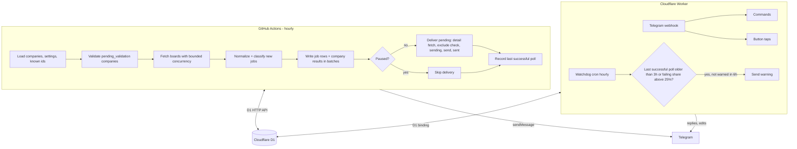

# feat: US remote senior SWE job alerts Telegram bot

## Summary

Build a single-user Telegram bot in two free-tier parts that share one Cloudflare D1 database.
- **Hourly poller:** a GitHub Actions workflow (Node) that fetches the public job boards of about 350 companies (Greenhouse, Lever, Ashby, Workable), detects new senior US-remote software roles, and sends one Telegram message per job with an apply link and Applied/Skip buttons.
- **Cloudflare Worker:** serves the Telegram webhook for commands and button taps. It also runs a light watchdog cron that warns if the poller stops.

---

## Problem Frame

The user wants fast alerts for senior remote-US software roles without paying for Remote Rocketship. The jobs it sells are scraped from public company job boards, which can be read free and legitimately at the source. The bot has to cost $0, run unattended, and avoid flooding the user (see origin: `docs/brainstorms/2026-10-06-us-remote-job-telegram-bot-requirements.md`).

---

## Requirements

Carried from the origin doc. IDs match the origin.

**Job sources**
- R1. Watch a seeded list of a few hundred remote-friendly companies on public-feed job boards (Greenhouse, Lever, Ashby, Workable).
- R2. Add or remove companies from Telegram. Confirm each change and report boards that can't be read. v1 narrows "by name and/or link" to a careers URL or board slug. A bare company name isn't resolvable without a search service.
- R3. Check each watched company about once an hour.

**Matching**
- R4. Remote roles only.
- R5. Location: explicit US is sent. Ambiguous or state-restricted US is sent with ⚠️. Clearly non-US is dropped.
- R6. Software engineering titles only, any tech stack.
- R7. Senior, Sr. and Lead titles only. Staff, Principal, mid, junior and intern are excluded.
- R8. A user-managed list of excluded words, matched against title and description.
- R9. Each job is sent at most once, including after edits and reposts.

**Alerts**
- R10. One message per job: title, company, location (with ⚠️ when it applies), salary if listed, how long ago it was posted when known, and the apply link.
- R11. The apply link is the company's own application page, tappable and copyable.
- R12. ✅ Applied / ❌ Skip buttons that record the choice and visibly update the message.
- R13. `/applied` lists jobs marked Applied, with company, title, link and date.

**Control and health**
- R14. `/status`: last check, companies watched, jobs sent today.
- R15. `/pause` / `/resume`. Jobs found while paused are recorded but never sent.
- R16. Warn the user when checks stop succeeding.
- R17. Zero recurring cost.

**Origin acceptance examples:** AE1–AE6 (ambiguous "Remote" is flagged, EMEA is dropped, Staff vs Sr., excluded word "clearance", pause/resume with no backlog, an edited job is not re-sent). Each is enforced by test scenarios below.

---

## Key Technical Decisions

- **Split the work: GitHub Actions does the polling, a Cloudflare Worker handles interaction.**
  - Cloudflare Workers Free caps each invocation at 10 ms of CPU and 50 subrequests. Parsing even one large Lever or Ashby board (full descriptions in the list response) can approach that, and a killed invocation can't record its own failure.
  - An hourly GitHub Actions job has no such caps. It runs a single job in a **private** repo: roughly 1–2 billed minutes per run, about 720–1,440 of the 2,000 free minutes a month. Private also avoids the 60-day auto-disable that applies to public repos and keeps config private.
  - GitHub can't receive webhooks, so a Worker serves Telegram. Worker work is tiny (a few D1 queries and one Telegram call per update), which fits the free limits comfortably.
- **One shared D1 database.** The Worker uses its D1 binding. The poller uses the D1 HTTP API with a Cloudflare API token scoped to D1 only, sending statements in batches.
  - D1 rather than KV, because KV free allows about 1k writes a day.
  - **Write-budget estimate:** the baseline is about 350 companies × about 50 jobs ≈ 17.5k job rows. With index writes that's roughly 3×, about 55k rows, once. After that, about 350 company updates plus new jobs per hour ≈ 10k rows a day. Both stay under the D1 free daily rows-written quota (verify the current figure during U1). If the baseline estimate runs high, seed in two halves on consecutive days.
- **Shared core code, two thin runtimes.** Board adapters, matching rules, message formatting, the Telegram client and storage logic live in one core module used by both runtimes. Storage logic is written against a small database interface with two drivers (D1 binding and D1 HTTP).
- **Poller run = detect, then deliver, in one process.** Fetch every active company (with bounded concurrency), diff against stored ids, classify, and insert new matches as `pending`. Then deliver: Greenhouse/Workable detail fetch for descriptions and salary, the excluded-word check, and send. With no subrequest cap, all pending jobs go out in the same run, spaced to respect Telegram's ~1 msg/s per chat limit.
- **At-most-once delivery.** Mark a job `sending` before calling Telegram, then `sent` with the message id after. A job found still `sending` on a later run is treated as sent (no message id) and is never resent. The rare loss case is preferred over duplicates (R9).
- **Silent baseline per company.** The first successful fetch of any company, whether from the seed or `/add`, records all current jobs as `seen` without sending.
- **Repost guard.** Dedupe is primarily on (company, board job id), so edits never re-send (AE6). A new id is a `duplicate` only when an earlier job from the same company with the same normalized title **and** location was sent or pending, **and** that earlier job is no longer on the board. That pattern is the real signature of a repost, so distinct same-title openings that coexist on the board are still sent.
- **Pause is a state, enforced in both phases.** `/pause` moves every `pending` job to `suppressed` and sets paused. While paused, detection stores new matches as `suppressed` and delivery is skipped entirely. On resume nothing old is sent (AE5).
- **Remote signal is three-valued: yes / no / unknown.** Greenhouse (no remote field) reports unknown unless the location text says remote, hybrid or on-site. Unknown remote with a US-only location is classified **ambiguous** (sent with ⚠️), not on-site, so Greenhouse "United States" postings aren't silently lost.
- **`/add` is validated by the poller, not the Worker.** The Worker parses the URL or slug and stores the company as `pending_validation`. The next poller run probes it, baselines it, and messages the result ("Added Acme (Lever, 42 open jobs)" or why it failed). This keeps heavy board parsing out of the Worker's CPU budget. The delay is up to one hour.
- **Owner-only, fail-closed webhook.**
  - The Worker rejects every request when the webhook secret or owner id isn't configured, and compares the secret-token header in constant time.
  - It authorizes on the sender's user id (`from.id`) and private chat type for both messages and callback queries. Anything else is ignored with 200.
  - Only the webhook path is served. Everything else returns 404.
- **Untrusted input handling.**
  - Board slugs must match `^[A-Za-z0-9_-]+$` and are URL-encoded into paths.
  - Excluded words are matched without dynamic regex (or regex-escaped) and length-capped.
  - Apply URLs must be `https`. Anything else is treated as an adapter parse failure.
  - Stored and displayed errors are redacted of tokens.
- **Toolchain:** TypeScript throughout. Wrangler for the Worker, Node 22 for the poller in GitHub Actions, Vitest for tests. Board responses are faked from recorded fixtures, so tests never hit the network.
- **Workable is included but fragile.** It uses the undocumented v3 jobs endpoint (fresher than the widget endpoint) and relies on failure tracking rather than special handling.

---

## High-Level Technical Design



**Job classification for a new board job id:**

| Condition (first match wins) | Stored status |
|---|---|
| Company not yet baselined | `seen` |
| Fails role, seniority or location rules | `seen` |
| Repost (same title + location, earlier job gone from board) | `duplicate` |
| Excluded word in title or description (when the description is already in the list payload) | `excluded` |
| Paused | `suppressed` |
| Otherwise | `pending` |

Delivery moves `pending` to `excluded` (via the detail-fetch description check) or to `sending` and then `sent`. `user_action` (`applied` / `skipped`) is set only on `sent` jobs and can be switched.

---

## Output Structure

```text
us-remote-job-bot/
  package.json
  tsconfig.json
  vitest.config.ts
  wrangler.toml
  migrations/0001_init.sql
  .github/workflows/poll.yml
  seed/companies.json
  scripts/build-seed.ts
  src/core/config.ts
  src/core/ats/{types,greenhouse,lever,ashby,workable,detect}.ts
  src/core/match/rules.ts
  src/core/store/{db,driver-binding,driver-http}.ts
  src/core/telegram/{client,format}.ts
  src/poller/run.ts
  src/poller/deliver.ts
  src/worker/index.ts
  src/worker/commands.ts
  src/worker/watchdog.ts
  test/fixtures/...
  test/*.test.ts
  README.md
```

---

## Implementation Units

Units are listed in build order. U-IDs are stable identifiers, not sequence numbers.

### U1. Project scaffold, schema and both runtimes

**Goal:** One repo that builds and deploys the Worker, runs the poller locally and in GitHub Actions, and applies the D1 schema.

**Requirements:** R3, R17

**Dependencies:** none

**Files:** `package.json`, `tsconfig.json`, `vitest.config.ts`, `wrangler.toml`, `migrations/0001_init.sql`, `.github/workflows/poll.yml`, `src/core/config.ts`, `src/worker/index.ts`, `src/poller/run.ts`, `test/smoke.test.ts`

**Approach:**
- **Workflow:**
  - Hourly schedule on an off-peak minute (e.g. 17 past) plus manual dispatch.
  - A concurrency group so runs never overlap, and a job timeout of about 15 minutes.
  - Secrets: Cloudflare account id, D1 database id, a D1-scoped API token, bot token and owner id.
- **Worker:** `fetch` serves the webhook, and `scheduled` (hourly) runs the watchdog.
- **Schema:**
  - `companies`: name, ats, board token, state `active | pending_validation | inactive`, baselined flag, last checked, last success, consecutive failures, redacted last error.
  - `jobs`: short integer id, company, board job id, normalized title, location text, apply URL, location flag, posted time, salary text, status, Telegram message id, user action, action time, first seen, last seen on board. Unique on company + board job id. Index on company + normalized title.
  - `settings`: key/value for paused, excluded words, last poll start, last successful poll, last poll stats (companies ok/failed, sent count) and last warning.
- **Config constants:** fetch concurrency, request timeout, repost window, watchdog thresholds (3h stale, 25% failing, 6h re-warn).
- Verify the current D1 free daily rows-written quota and record it in config comments.

**Patterns to follow:** Cloudflare Workers + D1 + Wrangler defaults. GitHub Actions scheduled-workflow conventions.

**Test scenarios:**
- Test expectation: the smoke test only checks that the Worker boots and migrations apply, since this unit is scaffolding.

**Verification:** `wrangler dev` serves a 404 on unknown paths. Migrations apply locally. A manual `workflow_dispatch` run completes against an empty database.

---

### U2. Job board adapters, normalization and detection

**Goal:** One adapter per board type that returns normalized jobs, plus parsing a careers URL or slug into board type and token.

**Requirements:** R1, R2, R10, R11

**Dependencies:** U1

**Files:** `src/core/ats/types.ts`, `src/core/ats/greenhouse.ts`, `src/core/ats/lever.ts`, `src/core/ats/ashby.ts`, `src/core/ats/workable.ts`, `src/core/ats/detect.ts`, `test/ats.test.ts`, `test/detect.test.ts`, `test/fixtures/`

**Approach:**
- **Normalized job:** id, title, location text, remote signal (`yes | no | unknown`), country hints, apply URL (https only), posted time, salary text, and description (optional, empty when not in the list payload).
- **Greenhouse:**
  - The list endpoint is fetched without content. Remote is `unknown` unless the location text or offices say remote, hybrid or on-site.
  - `fetchDetail` calls the job detail endpoint with `pay_transparency=true` (otherwise salary is never returned). It returns the double-unescaped description and `pay_input_ranges`.
- **Lever:** postings with `mode=json`. Remote comes from `workplaceType`. Uses `categories.location`/`allLocations`, `country`, `descriptionPlain`, `salaryRange`, `createdAt` and `hostedUrl`/`applyUrl`.
- **Ashby:** job board with compensation included. Drop jobs where `isListed` is false. Uses `isRemote`/`workplaceType`, location plus secondary locations, `descriptionHtml` (converted to text), compensation summary, `jobUrl` and `publishedAt` (informational only, since it can be years old).
- **Workable:** the v3 jobs endpoint, paginated via `nextPage`. Remote comes from `remote`/`workplace`, plus `location.countryCode`. `fetchDetail` returns the description.
- **Failures:** every adapter reports a typed failure (not found, HTTP error, timeout, parse error) instead of throwing. An empty Lever list is a valid empty board.
- **Detection:** first match on known host patterns (Greenhouse board/embed hosts or `gh_jid`, `jobs.lever.co`, `jobs.ashbyhq.com`, `apply.workable.com`/`*.workable.com`). A bare slug must match the safe slug pattern and is resolved by probing each board type. Probing runs only in the poller.
- Send a descriptive User-Agent on all requests.

**Test scenarios:**
- Each fixture normalizes to the expected id, title, apply URL, location text and remote signal.
- Greenhouse: "Remote - US" gives remote yes. "United States" gives remote unknown. Detail with `pay_input_ranges` gives the salary text. Empty ranges mean no salary. A double-escaped description becomes plain text.
- Ashby: an unlisted job is dropped. The compensation summary becomes the salary.
- Lever: `workplaceType` hybrid gives remote no. `descriptionPlain` is carried on the normalized job.
- Workable: two pages are combined via `nextPage`.
- A non-https apply URL becomes a parse failure, and the job is not emitted.
- A 404 is reported as not found. Malformed JSON is reported as a parse error, without throwing.
- Detection: each known URL form maps to the right board type and token. A slug containing `/`, `?` or `..` is rejected before any request is made.

**Verification:** All adapters pass against fixtures, and one live fetch per board type succeeds from the poller locally.

---

### U3. Matching rules

**Goal:** Pure functions for role, seniority, location class and excluded-word hits.

**Requirements:** R4, R5, R6, R7, R8

**Dependencies:** U2 (normalized job type)

**Files:** `src/core/match/rules.ts`, `test/rules.test.ts`

**Approach:**
- **Role:** software engineer/developer titles with software context (software, backend, frontend, full stack, mobile, iOS, Android, web, platform, or a bare "Software Engineer"). Reject sales, solutions and support engineer titles, data/ML/DevOps/SRE-only titles, and management titles (engineering manager, director).
- **Seniority:** accept `Senior`, `Sr`/`Sr.` and `Lead` as whole words. Reject whenever `Staff`, `Principal`, `Junior` or `Intern` appear, **even alongside Senior**. Reject `Mid`/`II`-style titles that have no Senior.
- **Location class:**
  - `onsite` when the remote signal is no, or the text says hybrid or on-site.
  - `us` when the remote signal is yes and the text or country code says US, USA, United States or a US state.
  - `us_restricted` when only specific states are named.
  - `ambiguous` when the remote signal is yes with no country, **or** the remote signal is unknown with a US-only location.
  - `non_us` when another country or region is named and US is not.
  - `us`, `us_restricted` and `ambiguous` pass. The last two get a ⚠️ and the reason.
- **Excluded words:** case-insensitive whole-word match over title plus description, done without user-built regex.

**Test scenarios:**
- Covers AE1. A posting with location "Remote" and a matching title is classified ambiguous, so it's flagged.
- Covers AE2. "Remote – EMEA" is classified non_us.
- Covers AE3. "Staff Software Engineer, Remote US" is rejected. "Sr. Frontend Engineer" is accepted.
- "Senior Staff Software Engineer" and "Senior Principal Engineer" are rejected.
- Covers AE4. With "clearance" excluded, a description containing "security clearance required" is excluded.
- "Remote – US (CA, NY, TX only)" is classified us_restricted. "Remote (US or Canada)" is classified us.
- Greenhouse-style unknown remote plus "United States" is classified ambiguous, not onsite.
- "Senior Sales Engineer" and "Senior Engineering Manager" are rejected. "Lead iOS Developer" is accepted.
- Hybrid with a US location is classified onsite.
- The excluded word "go" doesn't match "Google". An excluded word containing `(` or `*` neither throws nor matches unrelated text.

**Verification:** All origin acceptance examples pass as unit tests.

---

### U4. Storage layer and drivers

**Goal:** Storage operations shared by both runtimes, plus D1-binding and D1-HTTP drivers.

**Requirements:** R2, R9, R13, R14, R15

**Dependencies:** U1

**Files:** `src/core/store/db.ts`, `src/core/store/driver-binding.ts`, `src/core/store/driver-http.ts`, `test/db.test.ts`, `test/driver-http.test.ts`

**Approach:**
- **Interface:** `query` and `batch`. The HTTP driver posts statements in chunks and retries 5xx and 429 responses with backoff.
- **Bulk operations shaped for few round-trips:**
  - Load all active and pending-validation companies, settings and the known ids for all companies in one pass.
  - Write job inserts and company results in chunked batches.
- **Repost lookup:** candidates are earlier `sent`/`pending` jobs with the same company, normalized title and location, whose last-seen-on-board is older than the current run.
- **Pause:** set paused and move all `pending` jobs to `suppressed` in a single batch.
- **Delivery state:** mark `sending` and mark `sent` with the message id. Stale `sending` rows are treated as sent.
- **Queries:** the applied list (newest first), and status counts (sent today, active, failing, pending).

**Test scenarios:**
- Inserting the same company and board job id twice keeps one row (covers AE6 at the storage level).
- Repost: an earlier sent job with the same title and location that is no longer on the board makes the new id a duplicate. If the earlier job is still on the board, it isn't one.
- Pausing with 3 pending jobs leaves 0 pending and 3 suppressed.
- A job left in `sending` from an earlier run is not returned as deliverable.
- The HTTP driver retries a 429 then succeeds. A persistent 500 surfaces as an error without partial silent success.
- The applied list returns only applied jobs, newest first.

**Verification:** Storage tests pass against local D1. HTTP driver tests pass against a faked endpoint.

---

### U6. Telegram client and message formatting

**Goal:** A shared Telegram client and alert formatting.

**Requirements:** R10, R11, R12

**Dependencies:** U1

**Files:** `src/core/telegram/client.ts`, `src/core/telegram/format.ts`, `test/format.test.ts`, `test/telegram-client.test.ts`

**Approach:**
- **Client:** sendMessage, editMessageReplyMarkup/editMessageText and answerCallbackQuery. On 429 it honors `retry_after` (the poller waits; the Worker gives up gracefully). It ignores "message is not modified", and redacts the token from errors.
- **Format:**
  - HTML parse mode with escaping (`&`, `<`, `>`, and `"` inside `href`).
  - Title in bold, company, location plus ⚠️ reason, salary only if present, "posted Xh ago" only for posted times under 30 days old.
  - The apply URL as a visible link (tap to open, long-press to copy). Link preview disabled. Never the description.
- **Buttons:** `a:<jobId>` / `s:<jobId>`, using the short integer id to stay under the 64-byte callback limit. After a choice, the keyboard shows the chosen state plus the opposite option, so the choice can be switched.

**Test scenarios:**
- A title with `<` and `&` is escaped. A missing salary means no salary line. An ambiguous location shows ⚠️ and the reason. A 2021 Ashby date shows no "posted ago".
- The callback data for a job stays under 64 bytes.
- The client honors `retry_after` on 429. Error messages never contain the bot token.

**Verification:** Tests pass, and a manual send renders correctly in Telegram.

---

### U5. Poller run: detect and deliver

**Goal:** The hourly job that validates new companies, checks all boards, classifies jobs and sends alerts.

**Requirements:** R1, R2, R3, R4–R9, R10, R15

**Dependencies:** U2, U3, U4, U6

**Files:** `src/poller/run.ts`, `src/poller/deliver.ts`, `test/poller.test.ts`, `test/deliver.test.ts`

**Approach:**
- Record the poll start time.
- **Validate `pending_validation` companies:** probe them. On success, baseline them, make them active and message "Added …". On failure, make them inactive and message the reason.
- **Fetch all active companies** with bounded concurrency and a per-request timeout. Classify new ids per the classification table. Run the excluded-word check here when the list payload already includes the description (Lever, Ashby). Update last seen on board for known jobs.
- **Write results in batches.** A failure for one company increments its failure count without affecting others.
- **If not paused, deliver all pending jobs** oldest first: detail fetch where the description or salary is missing (Greenhouse, Workable), then the excluded-word check, then `sending` → send → `sent`. Space sends about 1.1 s apart. A failed detail fetch leaves the job pending for the next run.
- Record the last successful poll (at least one company fetched OK) and stats.

**Test scenarios:**
- Covers the first-run decision. A company's first fetch with 5 matching jobs stores 5 `seen` and sends nothing.
- A baselined company with one new matching job produces exactly one Telegram send, and the job ends `sent` with a message id.
- Covers AE5. Paused: a new match becomes `suppressed` and delivery sends nothing. After resume, the next run sends only jobs found after resuming.
- Covers AE6. A known id with a changed title is not reinserted or re-sent.
- Covers AE4 on Lever. A Lever job whose `descriptionPlain` contains an excluded word becomes `excluded` at detection.
- Covers AE4 on Greenhouse. A pending job whose detail description contains an excluded word becomes `excluded` and nothing is sent.
- One board times out while the others succeed: only that company's failure count goes up.
- A `pending_validation` Lever URL is validated, baselined, made active, and a confirmation message is sent. An unreachable one ends inactive with an explanation message.
- A send failure after the job was marked `sending` doesn't resend it on the next run.

**Verification:** Tests pass with fixture-backed fake fetch and local D1. A manual `workflow_dispatch` against the real D1 completes and sends a test alert.

---

### U7. Worker webhook, commands and button handling

**Goal:** Handle owner commands and button taps.

**Requirements:** R2, R8, R12, R13, R14, R15

**Dependencies:** U2 (URL/slug parsing only), U4, U6

**Files:** `src/worker/index.ts`, `src/worker/commands.ts`, `test/webhook.test.ts`, `test/commands.test.ts`

**Approach:**
- **Auth:** fail closed when the secret or owner id is missing. Constant-time comparison of the secret header. Authorize on `from.id` plus private chat type. Serve only the webhook path and return 200 quickly.
- **Commands:**
  - `/add <url|slug>` parses and stores the company as `pending_validation`, and replies "will be checked within the hour".
  - `/remove <name>` marks the company inactive. `/companies` lists companies, with failing ones marked.
  - `/exclude add|remove|list <word>` (length-capped).
  - `/pause` (also moves pending to suppressed) and `/resume`.
  - `/status`, `/applied` (last 20) and `/help`.
- **Buttons:** record the user action and time, answer the callback, and update the keyboard. A repeat tap is idempotent, and the choice can be switched.

**Test scenarios:**
- Secret unset in config: every request returns 401.
- A wrong or missing secret header returns 401, and nothing changes.
- A message or callback from a non-owner user id, or from a group chat, is ignored with 200.
- `/add https://jobs.lever.co/acme` creates a pending_validation company and replies. `/add foo/../bar` is rejected with an explanation.
- `/remove acme` makes the company inactive.
- `/exclude add clearance` then `/exclude list` shows it once, even if added twice.
- Covers AE5 at the command level. `/pause` with 2 pending jobs suppresses both. `/resume` clears paused and sends nothing old.
- Tapping Applied records applied and edits the keyboard. Tapping Skip switches the choice. A double tap is idempotent.
- `/applied` with nothing applied replies with a friendly empty message.

**Verification:** Tests pass, and each command works from the owner's Telegram after deploy.

---

### U8. Health watchdog and status

**Goal:** `/status` output, plus a warning when polling stops or mostly fails.

**Requirements:** R14, R16

**Dependencies:** U4, U6

**Files:** `src/worker/watchdog.ts`, `test/watchdog.test.ts`

**Approach:**
- **`/status`:** last poll start, last successful poll, active / failing / pending-validation company counts, jobs sent today, pending count, paused state.
- **Watchdog (Worker hourly cron):** warn when the last successful poll is older than 3 hours, or when failing companies exceed 25% of active ones. Re-warn at most every 6 hours.
- Because the watchdog runs on Cloudflare, it detects GitHub Actions stopping entirely (disabled workflow, exhausted minutes, a broken secret).

**Test scenarios:**
- Last successful poll 4h ago gives one warning. A second watchdog run within 6h gives none.
- 30% of companies failing gives a warning. 10% gives none.
- A healthy state gives no warning.
- `/status` with 2 failing companies reports that count.

**Verification:** Tests pass. Disabling the workflow in GitHub produces a warning within about 4 hours.

---

### U9. Seed company list builder

**Goal:** A validated list of about 350 remote-friendly companies with board tokens.

**Requirements:** R1

**Dependencies:** U2

**Files:** `scripts/build-seed.ts`, `seed/companies.json`, `test/build-seed.test.ts`

**Approach:**
- A local Node script.
- Pulls candidates from open-source lists (remoteintech/remote-jobs careers URLs, plus other aggregators' board-token lists). Check licenses before reuse.
- Resolves each candidate's board, probes it, and keeps boards that respond and have at least one software role.
- Writes `seed/companies.json` and an idempotent insert of companies as `pending_validation`. The first poller run then baselines them. If the write-budget estimate runs high, the poller baselines them in two halves across two days.

**Test scenarios:**
- A candidate with a Greenhouse URL resolves to its token.
- A candidate whose probe returns not found is excluded.
- Duplicates across sources (same board type and token) are collapsed.
- Running the seed twice doesn't duplicate companies.

**Verification:** The script yields at least 250 valid companies, and the seed applies cleanly.

---

### U10. Setup and deploy guide

**Goal:** The user can get from zero to a running bot with one README.

**Requirements:** R17

**Dependencies:** U1–U9

**Files:** `README.md`

**Approach:**
- Create the bot with @BotFather and get your user id.
- Create a free Cloudflare account and the D1 database, and apply the migrations.
- Create a D1-only API token.
- Generate a high-entropy webhook secret.
- Deploy the Worker and set its secrets. Register the webhook with `secret_token` and `allowed_updates`.
- Create a **private** GitHub repo, add the Actions secrets and enable the workflow.
- Run the seed.
- Daily commands, troubleshooting, the free-tier limits relied on, and how to rotate the bot token or webhook secret.

**Test scenarios:**
- Test expectation: none -- documentation only.

**Verification:** A fresh setup following only the README reaches a working `/status` reply and a test alert.

---

## Scope Boundaries

- Remote Rocketship as a source, whether by scraping or paid access (outside this product's identity).
- Workday and custom careers sites without a public feed (deferred for later).
- Resolving a bare company name in `/add` (deferred: v1 takes a URL or slug).
- Salary floor, fit scoring, résumé matching and auto-apply.
- Multiple users.
- Checking faster than about hourly.

### Deferred to Follow-Up Work

- `/add` for custom careers domains (scanning the page HTML for board hosts).
- More precise Telegram-send-failure alerting beyond the failing-share and staleness rules.

---

## Risks & Dependencies

| Risk | Mitigation |
|---|---|
| GitHub Actions free minutes are exhausted (private repo, 2,000 a month) | A single job with a 15-minute timeout, typically 1–2 minutes a run. The watchdog warns if polling stops. The README notes checking usage. |
| GitHub schedule delays or skipped runs | Hourly cadence tolerates delay. An off-peak minute is used, and the watchdog's 3h threshold avoids false alarms. |
| D1 HTTP API rate limits or outages | Chunked batches with retry and backoff. A failed run is caught by the watchdog. |
| D1 free daily write quota hit on seeding day | Write-budget estimate in Key Technical Decisions. Baseline split across two days if needed. |
| Workable endpoints are undocumented and change | Typed failures, failure counts and watchdog failing-share warnings. |
| Location text too varied for the rules | Three-valued remote signal. Ambiguous cases are flagged, not dropped. Fixtures from real boards drive the tests. |
| Seed lists are stale | Probe-validated at build time. Failing companies show in `/companies` and `/status`. |
| Bot token or API token leak | Secrets only in Worker and Actions secret stores. Errors redacted. The D1 API token is scoped to D1. Rotation steps in the README. |

---

## Sources & Research

- Greenhouse Job Board API: https://developers.greenhouse.io/job-board.html
- Lever Postings API: https://github.com/lever/postings-api
- Ashby public job posting API: https://developers.ashbyhq.com/docs/public-job-posting-api
- Cloudflare Workers limits (10 ms CPU and 50 subrequests on free, the reason polling moved to Actions): https://developers.cloudflare.com/workers/platform/limits/
- Cloudflare D1 limits: https://developers.cloudflare.com/d1/platform/limits/
- GitHub Actions schedule behavior: https://docs.github.com/en/actions/reference/workflows-and-actions/events-that-trigger-workflows
- Vercel cron limits (ruled out): https://vercel.com/docs/cron-jobs/usage-and-pricing
- Seed sources: https://github.com/remoteintech/remote-jobs, https://github.com/Feashliaa/job-board-aggregator
- Telegram Bot API (webhook secret token, inline keyboards, 64-byte callback data, HTML parse mode): https://core.telegram.org/bots/api
